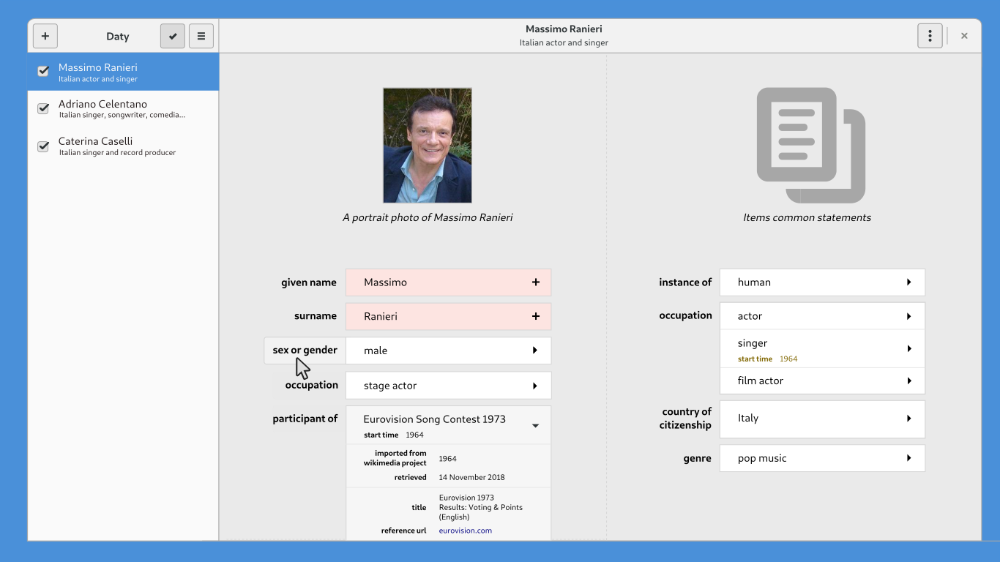

# Daty

*Daty* is a free cross-platform advanced Wikidata editor adhering to [GNOME Human Interface Guidelines](https://developer.gnome.org/hig/stable/), intended to enable simpler editing workflows and faster deployment of requested user features. You can use *Daty* to search, select, read, batch edit items, script actions, share and visualize proposed changes and bots.

*Daty* is written in Python 3 and it uses [GTK+ 3.0](https://developer.gnome.org/hig/stable/) python bindings for interface organization and drawing.

## Development

You have to install `Gobject` python bindings and install `pywikibot` library on your computer to run *Daty*. On the following distros, you can do that by running:

#### Archlinux
    # pacman -S python-gi pip
    # pip install pywikibot

#### Ubuntu/Debian
    # apt install python3-gi gir1.2-gtk3.0 pip3
    # pip3 install pywikibot

At the moment, you need to manually configure your wikimedia account to use *Daty*. Actually, you just need to create bot credentials at [this page](https://www.wikidata.org/wiki/Special:BotPasswords) and include them in the `user-config.py` and `user-password.py` files in the `daty/example` directory and put them in the directory you want to run daty.

Now, to test the program, just run

    ./daty/__init__.py

## About

This program is licensed under [GNU General Public License v3 or later](https://www.gnu.org/licenses/gpl-3.0.en.html) by [Pellegrino Prevete](http://prevete.ml). 
If you find this program useful, consider voting to give this project a grant at the [itWikiCon 2018 Ideathon](https://meta.wikimedia.org/wiki/ItWikiCon/2018/Ideathon), or offering me a [beer](https://patreon.com/tallero), a new [computer](https://patreon.com/tallero) or a part time remote [job](mailto:pellegrinoprevete@gmail.com) to help me pay the bills.

